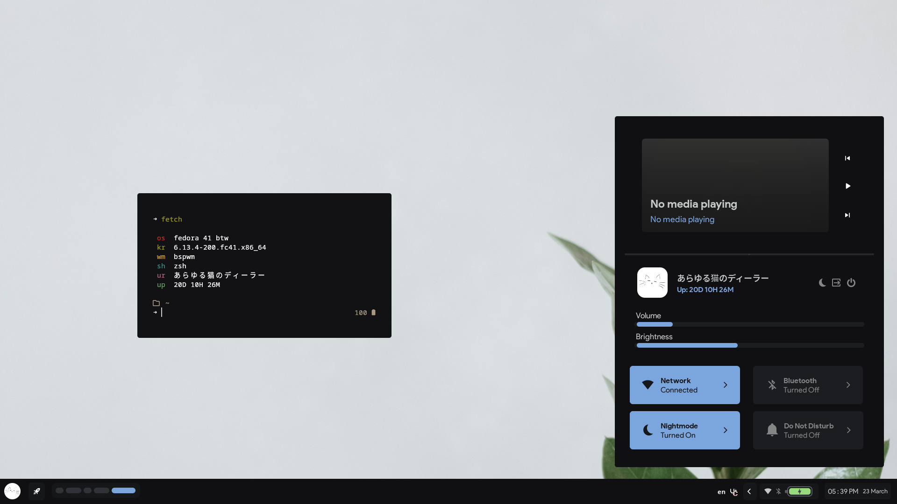

 

# fibreglass

> [!WARNING]
> This project is in very early stages, so expect many bugs.

## Features
- **Distro** -> Fedora 41
- **WM** -> bspwm
- **Shell** -> zsh
- **Terminal** -> kitty
- **Compositor** -> picom

## Video Showcase
https://github.com/user-attachments/assets/8c6f7ea9-ba65-470e-8e3e-7c1554ad7dc5

## Credits
- [Failed](https://github.com/Failedex), for being my much-abused eww helpline.
- [Kate](https://github.com/jiyutake), for critiquing my design.
- [Eve](https://github.com/CelestialCrafter), for being my general helpline and for also critiquing my design.

## ~~Allowing me to steal designs~~ Inspirations
- [Namishh](https://github.com/namishh)
- [Saimoon](https://github.com/saimoomedits)
- [Failed](https://github.com/Failedex) (again)
- [Rayhan](https://github.com/raexera)
