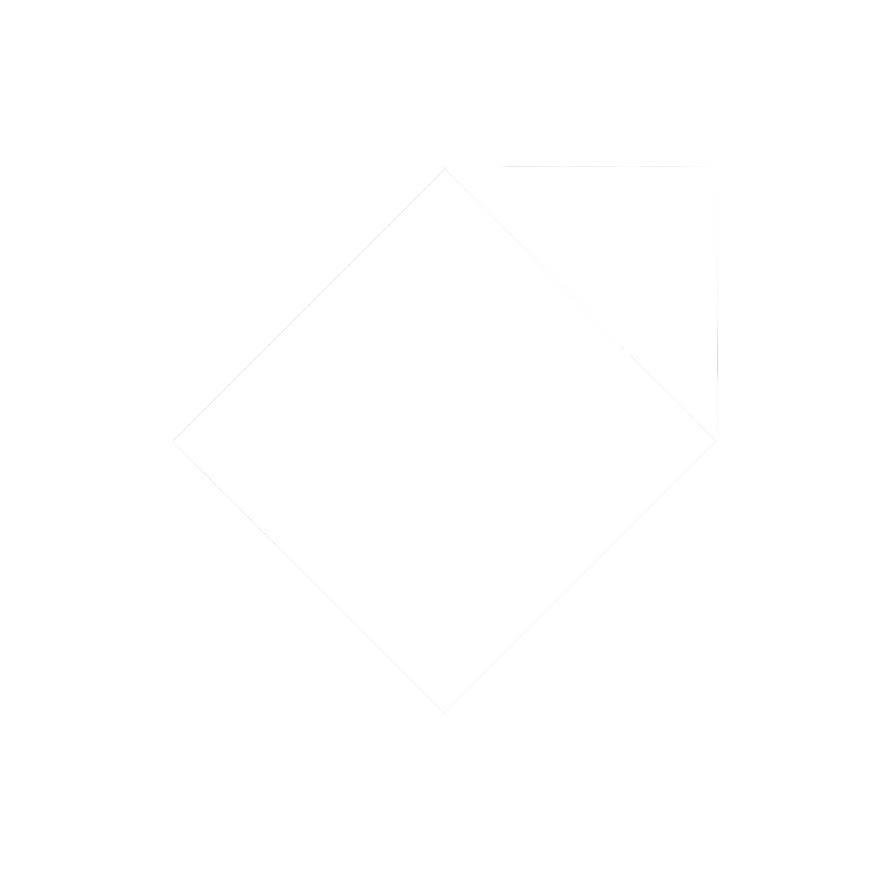
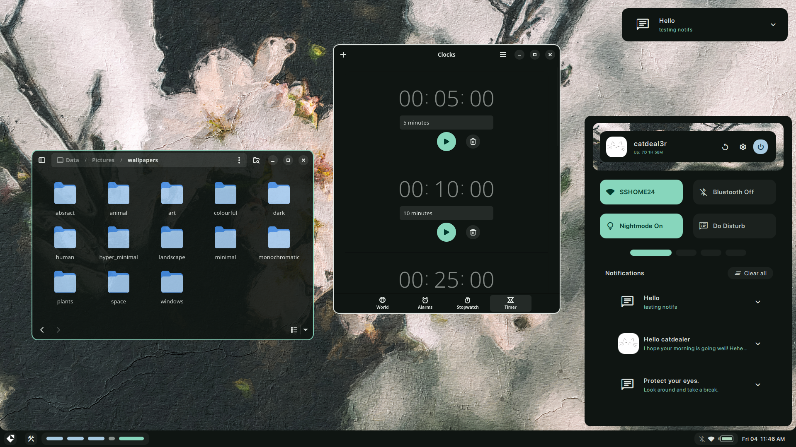
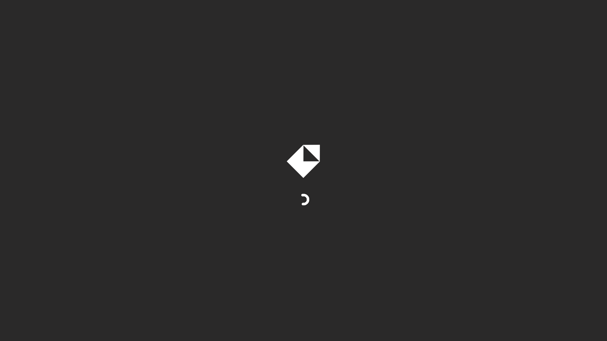

<a name="top_marker"/>

# Fibreglass

---

> [!IMPORTANT]
> You might notice that all the code/configs are gone. This is because I'm doing a complete refactor, as well as switching to using [`Quickshell`](https://quickshell.outfoxxed.me/) for the widgets.
> If you would like to read the old code, browse the branches.

> [!WARNING]
> This project is very young, and the code may be refactored without notice.

## Table of Contents
- [Showcase](#showcase)
- [Todo](#todo)
- [Credits](#credits)
- [Inspirations](#allowing-me-to-steal-designs-inspirations)

---

## Showcase

### Photos

| **GTK Theming and Dashboard** |
| ---- |
|  |

| **Splash screen** |
| ---- |
|  |

### Videos

https://github.com/user-attachments/assets/767b5f0d-4ffc-46d6-8b4d-1ea0c74d42dc

---

## Todo
### Done
- [x] Create basic bar. `v0.1`
- [x] Make notifications. `v0.1`
- [x] Create a splash screen `v0.1`
- [x] Change all icons to material icons. `v0.1`

### Still todo
- [ ] Create userboard, notification center, and dashboard.
- [ ] Add button on bar to open the userboard.
- [ ] Add wallpapers to repository.
- [ ] Refactor/clean up the code in general.
- [ ] Make lockscreen.
- [ ] Add jgmenu/right click menu support.
- [ ] Implement desktop icons.
- [ ] Create settings menu.
- [ ] Change the fallback icon for notifications without an icon.
- [ ] Create search menu instead of using rofi.
- [ ] Add support for getting colours from the wallpaper.
- [ ] Add support for different ui theme (material, ascii, etc)

---

## Credits
- [Failed](https://github.com/Failedex), for critiquing my design.
- [Kate](https://github.com/jiyutake), for critiquing my design.
- [Eve](https://github.com/CelestialCrafter), for being my general helpline and for also critiquing my design.
- [Outfoxxed](https://outfoxxed.me/), for helping with this config and creating quickshell.
- [End-4](https://github.com/end-4/), for helping me with notifications and other code.
- [Rexiel](https://github.com/Rexcrazy804), for helping me with animations.
- [Soramane](https://github.com/soramanew), for helping with animations / notifications.

## ~~Who I stole designs from~~ Inspirations
- [Namishh](https://github.com/namishh), for widget design and colours.
- [Saimoon](https://github.com/saimoomedits), for the colourscheme.
- [Failed](https://github.com/Failedex) (again), for widget design.
- [Rayhan](https://github.com/raexera), for widget design and colours.
- [Tokyob0t](https://github.com/tokyob0t), for widget design.
- [Soramane](https://github.com/soramanew), for widget design and colour schemes.
- [End-4](https://github.com/end-4), for widget design.

---
*[Back to top](#top_marker)*

