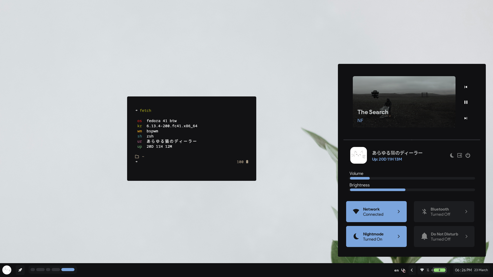
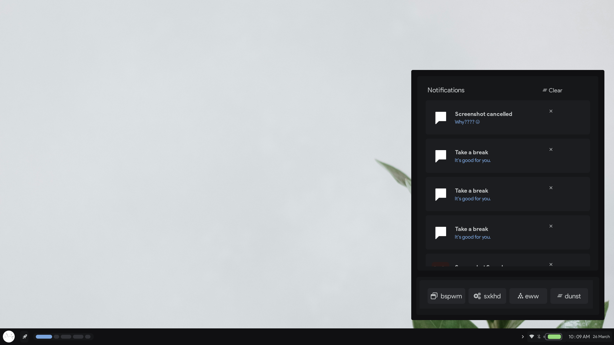

<a name="top_marker"/>

  

[)](https://github.com/dealerofallthecats/fibreglass)

---

> [!WARNING]
> This project is in very early stages, so expect many bugs.

## Table of Contents
- **[Features](#features)**
- [Featuring](#featuring)
- **[Video Showcase](#video-showcase)**
- [In-depth Infomation](#in-depth-infomation)
- **[FAQ](#faq)**
- [Todo](#todo)
- [Credits](#credits)
- [Inspirations](#allowing-me-to-steal-designs-inspirations)

---

## Features
- *Smooth* animations (thanks failed)
- Clean but functional bar.
- Bspwm config with all the basic fixes you need.
- Aesthetic dashboard.
- Custom colourscheme, fibreglass, based off Awesthetic-dark (*from Saimoonedits*).
- Reliability build in - this project is suitable for daily use.

## Featuring
- **Distro**     -> Fedora 41
- **WM**         -> bspwm
- **Shell**      -> zsh
- **Terminal**   -> kitty
- **Compositor** -> picom
- **Widgets**    -> eww

## Video Showcase
https://github.com/user-attachments/assets/8c6f7ea9-ba65-470e-8e3e-7c1554ad7dc5

## Screenshots
| Modern Dashboard & Bar |
| --- |
|  |

| Modern Notification center & Reload menu |
| --- |
|  |

---

## In-depth infomation
| Programs required | Supporting Programs | Tools I use |
| - | - | - |
| bspwm | playerctl | Geany |
| sxhkd | mocp | NVim |
| picom | CUrl | Portmaster |
| dunst | thunar | mocp |
| eww | oh-my-posh | amberol | 
| rofi | zinit | cava |
| feh | zen | cavalier |
| kitty | firefox | fcitx5 |
| zsh | | krita |
| | | gimp |

### Fonts used
- 0xProto Nerd Font (purely to display nerd font icons)
- Product Sans (for all the ui)
- Hack (for the terminal)

---

## FAQ
> **Q**: *Why is there no installation script/instructions?*

**A**: This project is currently in pre-release stages; hence no installation script or instructions are needed.

> **Q**: *Why does (such-and-such) not work?*

**A**: This setup, while being made as flexible and reliable as possible, is bound to have some bugs. Please report all of them in the "Issues" tab.

> **Q**: *How do I replicate (such-and-such) part of this config?*

**A**: The code is all there; have a read through it. 

---

## Todo
### Done
- [x] Create bar. *v0.1*
- [x] Add dashboard. *v0.15*
- [x] Restyle the dashboard's quick toggles. *v0.2*
- [x] Style dashboard's music widget. *v0.2*
- [x] Extend the bar's functionality. *v0.27*
- [x] Fix styling of the statuses on bar. *v0.3*
- [x] Fix padding and margin on bar. (Thanks Kate) *v0.31*
- [x] Reposition notifications. *v0.31*
- [x] Optimize dashboard's quick toggles. *v0.31*
- [x] Creating notification + quick reload center. *v0.32*
- [x] Fix some css styling bugs on the dashboard buttons. *v0.32*

### In progress
- [ ] Add hover styling for the bar's statuses and date.

### Still todo
- [ ] Create userboard and productivity-board.
- [ ] Restyle quicktoggles.
- [ ] Add indicator on the side on date to show the amount of notifications in the notification center.
- [ ] Add button on bar to open the productivity-board.
- [ ] Use mako or something instead of dunst for flatpak support.
- [ ] Add wallpapers to repository.
- [ ] Refactor/clean up the code in general.
- [ ] Change all icons to material icons.
- [ ] Restyle rofi or switch it out for eww.
- [ ] Create custom lockscreen widgets to be overlayed on top of i3lock-color, or create a custom lockscreen with just eww.
- [ ] Add jgmenu support -> probably using a eww window that covers the desktop.
- [ ] Implement desktop icons in eww.
- [ ] Create settings menu. 

---

## Credits
- [Failed](https://github.com/Failedex), for being my much-abused eww helpline, and for providing some scripts.
- [Kate](https://github.com/jiyutake), for critiquing my design.
- [Eve](https://github.com/CelestialCrafter), for being my general helpline and for also critiquing my design.
- [MarioRRom](https://github.com/MarioRRom), for the dunst notification script.
- [Gh0stzk](https://github.com/gh0stzk), for some quick toggle scripts (have been modified).

## ~~Who I stole designs from~~ Inspirations
- [Namishh](https://github.com/namishh), for widget design and colours.
- [Saimoon](https://github.com/saimoomedits), for the colourscheme.
- [Failed](https://github.com/Failedex) (again), for widget design.
- [Rayhan](https://github.com/raexera), for widget design and colours.
- [Tokyob0t](https://github.com/tokyob0t), for widget design.

---
*[Back to top](#top_marker)*
