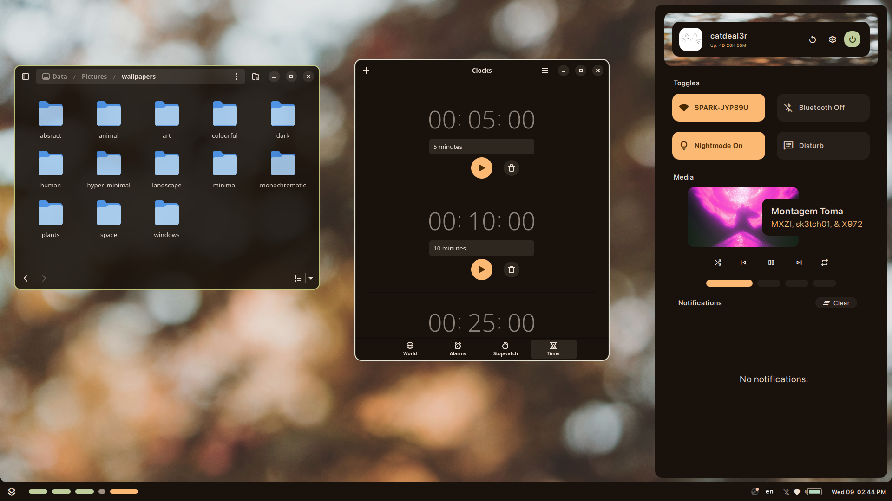

<a name="top_marker"/>
<div align="center">


[)](https://github.com/dealerofallthecats/fibreglass)


---

</div>

> [!IMPORTANT]
> You might notice that all the code/configs are gone. This is because I'm doing a complete refactor, as well as switching to using [`Quickshell`](https://quickshell.outfoxxed.me/) for the widgets.
> If you would like to read the old code, browse the branches.

> [!WARNING]
> This project is very young, and the code may be refactored without notice.

## Table of Contents
- [Showcase](#showcase)
- [Install](#install)
- [Issues](#known-issues)
- [Todo](#todo)
- [Credits](#credits)
- [Inspirations](#allowing-me-to-steal-designs-inspirations)

---

## Showcase

### Photos

| **GTK Theming and Dashboard** | **Alternative Bar Location + Styling** |
| ---- | ---- |
|  |  |


| **Splash screen** |
| ---- |
|  |


### Video

(Old)

https://github.com/user-attachments/assets/767b5f0d-4ffc-46d6-8b4d-1ea0c74d42dc

---

## Install
> [!Important]
> This section has been **MINIMALLY** tested, and is likely to change. Follow **AT YOUR OWN RISK!**

### Download and install dependancies 

Debian/Ubuntu (untested):
```bash
sudo apt install bspwm sxhkd picom rofi qt6-svg-dev qt6-multimedia-dev qt6-5compat-dev git stow qt6-base-dev qt6-declarative-dev qt6-shadertools-dev spirv-tools pkg-config kitty nautilus maim libqt6dbus6 ninja-build cmake libcli11-dev libjemalloc-dev
```

Fedora:
```bash
sudo dnf install bspwm sxhkd picom rofi qt6-qtsvg-devel qt6-qtimageformats qt6-qtmultimedia-devel qt6-qt5compat-devel git stow qt6-qtbase-devel qt6-qtdeclarative-devel qt6-qtshadertools-devel spirv-tools pkg-config kitty nautilus libxcb xprop maim dbus-qt3 ninja cmake glibc-minimal-langpack info patch cli11-devel breakpad-devel jemalloc-devel qt6-qtbase-private-devel
```

### Build quickshell-git
```bash
cd ~
git clone https://github.com/quickshell-mirror/quickshell quickshell-git
cd quickshell-git
sudo cmake -GNinja -B build -DCMAKE_BUILD_TYPE=RelWithDebInfo -DWAYLAND=OFF -DSERVICE_PAM=OFF -DHYPRLAND=OFF
sudo cmake --build build
sudo cmake --install build
```

### Install fibreglass 
> [!Warning]
> Continuing from here **will** overwrite your dotfiles.

Dotfiles affected:
- bspwm
- matugen
- kitty
- picom
- zshrc
- oh-my-posh
- quickshell
- picom
- rofi
- sxhkd

```bash
cd ~
git clone https://github.com/dealerofallthecats/fibreglass/
cd fibreglass
stow .
```


---

## Known Issues
### Dashboard appears too high above or below the bar.

| Key | Content |
| --- | --- |
| **Description** | This issue seems to be related to x11's positioning of PanelWindows, and changing content. | 
| **Timing** | I encounter this the most while editing code, or after switch the bar location. | 
| **Workaround** | Reload quickshell. |

### Can't click around the top right corner of the screen.

| Key | Content |
| --- | --- |
| **Description** | This is an issue with the notifications mask. The window is not correctly masking focus to each notification, and is instead masking to the entire window. |
| **Timing** | Currently, this bug consistently happens when you reload/start quickshell. |
| **Workaround** | Send a notification, then wait for it to clear or dismiss it. This will reset the mask to the correct position. |

### Notifications with no text, appname, or time appear with the default notification icon.

| Key | Content |
| --- | --- |
| **Description** | This issue is a well known issue with quickshell's notification server. It involves these "ghost" notifications, which are notifications that haven't been properly removed by the notification server. |
| **Timing** | This happens mostly while I'm editing code, so it shouldn't effect the user |
| **Workaround** | Force quickshell to discard all the notifications by clicking on the dashboard's "Clear" button. |


---

## Roadmap 
### Done
- [x] Create basic bar. `v0.1`
- [x] Make notifications. `v0.1`
- [x] Create a splash screen `v0.1`
- [x] Change all icons to material icons. `v0.1`
- [x] Create basic dashboard. `v0.2`
- [x] Work on notifications. `v0.2`
- [x] Add button on bar to open the userboard. `v0.2`
- [x] Change the fallback icon for notifications without an icon. `v0.2`
- [x] Add support for getting colours from the wallpaper using matugen. `v0.2`
- [x] Start converting config into json `v0.2`
- [x] Make matugen not trigger a reload on colour change `v0.2`
- [x] Added support for a top bar `v0.2`
- [x] Improved dashboard animations and design `v0.3`
- [x] Basic player control added to dashboard `v0.3`

### Still to come
- [ ] Create userboard, and tools menu.
- [ ] Add wallpapers to repository.
- [ ] Refactor/clean up the code in general.
- [ ] Make lockscreen.
- [ ] Add jgmenu/right click menu support.
- [ ] Implement desktop icons.
- [ ] Create settings menu.
- [ ] Create search menu instead of using rofi.
- [ ] Add support for different ui theme (material, ascii, etc)

---

## Credits
- [Failed](https://github.com/Failedex), for critiquing my design.
- [Kate](https://github.com/jiyutake), for critiquing my design.
- [Eve](https://github.com/CelestialCrafter), for being my general helpline and for also critiquing my design.
- [Outfoxxed](https://outfoxxed.me/), for helping with this config and creating quickshell.
- [End-4](https://github.com/end-4/), for helping me with notifications and other code.
- [Rexiel](https://github.com/Rexcrazy804), for helping me with animations.
- [Soramane](https://github.com/soramanew), for helping with animations / notifications.

## ~~Who I stole designs from~~ Inspirations
- [Namishh](https://github.com/namishh), for widget design and colours.
- [Saimoon](https://github.com/saimoomedits), for the colourscheme.
- [Failed](https://github.com/Failedex) (again), for widget design.
- [Rayhan](https://github.com/raexera), for widget design and colours.
- [Tokyob0t](https://github.com/tokyob0t), for widget design.
- [Soramane](https://github.com/soramanew), for widget design and colour schemes.
- [End-4](https://github.com/end-4), for widget design.

---
*[Back to top](#top_marker)*

